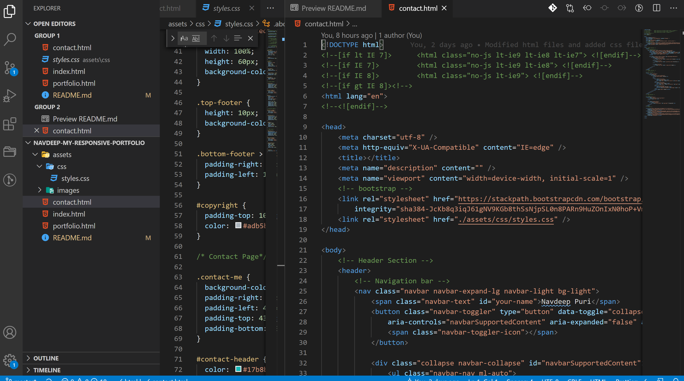

# Navdeep-Portfolio

## The Repository

The link to the website repository: [Website Repo link](https://github.com/NavdeepDP/Navdeep-Portfolio)

The site is published at [Published Website link](https://navdeepdp.github.io/Navdeep-Portfolio/)

## Development Environment
Code is developed in VS code Studio

## Website Structure

Website consists of three pages:

- Contact
- Portfolio
- About

These pages are accessible through the Navbar links.

## Installation

- Code is developed using VS Code studio.
- Code is available at the GITHub repository link: [Website Repo link](https://github.com/NavdeepDP/Navdeep-Portfolio)
- Get the code code in your local machine by using the clone option in the repository link.
- Click "Code" and copy the Clone with SSH key link.
- In Git bash, go to the appropriate directory and get the code using "git clone" command.
- Open index.html. Right click and open in browser of your choice to view the website.

## Additional checks

- Used W3C Validator to the check the validity of Web document.
- Checked the web page on mobile for the appearance, styles and responsiveness.

## References

- [w3schools.com](https://www.w3schools.com/)
- [Bootstrap documentation: https://getbootstrap.com/](https://getbootstrap.com/)

